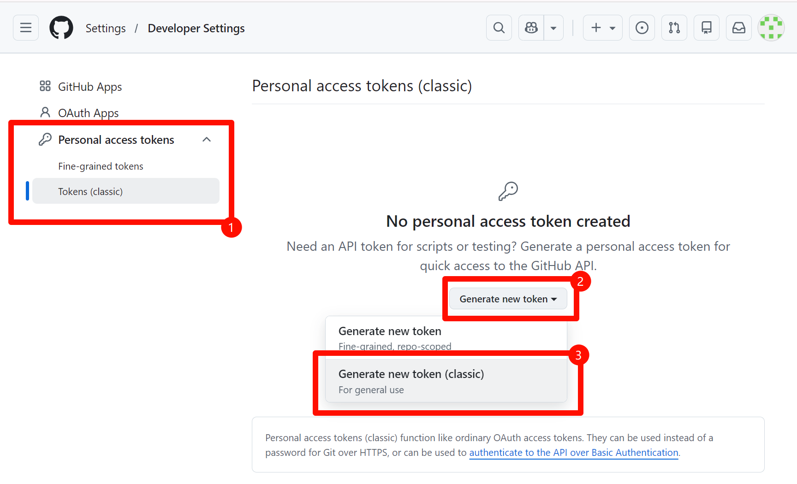

# koishi-plugin-adapter-github

## 1. 生成 Personal Access Token (PAT)

为了让 Koishi 机器人能够代表你的 GitHub 账号进行操作（例如读取事件、发表评论），你需要创建一个 Personal Access Token。

1. 访问 GitHub 的 [Personal Access Token 设置页面](https://github.com/settings/tokens)。
2. 点击右侧 **"Generate new token"**，然后从弹出的菜单中选择 **"Generate new token (classic) `For general use`"**。
3. 在 **"Note"** 字段中，为你的 Token 取一个容易识别的名字，例如 `koishi-bot-adapter-github-token`。
4. 在 **"Select scopes"** 部分，勾选以下权限：
    * `repo` (完全控制私有仓库)
    * `read:user` (读取用户信息)
    * `read:discussion` (读取 Discussions)
    * `write:discussion` (发表和修改 Discussions)
5. 点击页面底部的 **"Generate token"**。
6. **立即复制生成的 Token**。这个 Token 只会显示一次，请妥善保管。

---

## 2. 插件配置

在 Koishi 的插件市场中找到 `adapter-github` 并进行配置。

* **`token`**: 粘贴你刚刚生成的 Personal Access Token。
* **`owner`**: 填写你想要监听的仓库的所有者的名称。
* **`repo`**: 填写你想要监听的仓库名称。
* **`interval`**: 设置机器人检查更新的频率（单位：秒）。

---

* **代理配置**: 如果你的网络环境需要代理才能访问 GitHub，请启用并填写正确的代理地址。
* **调试设置**: 如果插件工作不正常，可以开启日志调试模式以输出更详细的信息。

配置完成后，启用插件即可。机器人将会开始监听指定仓库的动态。
