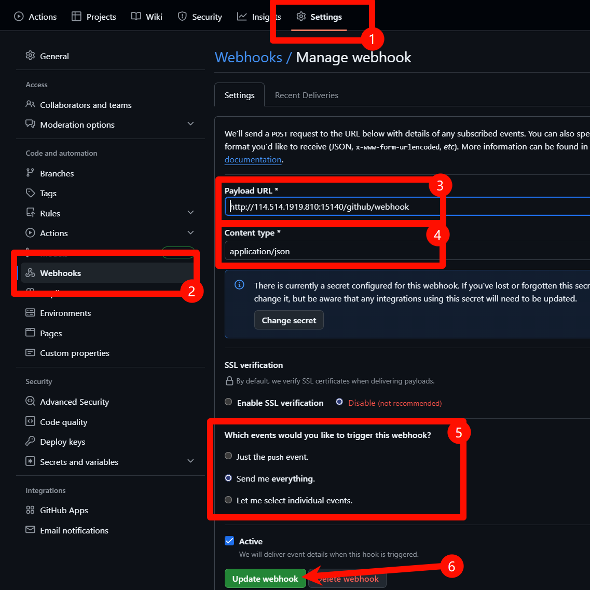

# koishi-plugin-adapter-github

## 1. 生成 Personal Access Token (PAT)

为了让 Koishi 机器人能够代表你的 GitHub 账号进行操作（例如读取事件、发表评论），你需要创建一个 Personal Access Token。

1. 访问 GitHub 的 [Personal Access Token 设置页面](https://github.com/settings/tokens)。
2. 点击右侧 **"Generate new token"**，然后从弹出的菜单中选择 **"Generate new token (classic) `For general use`"**。
3. 在 **"Note"** 字段中，为你的 Token 取一个容易识别的名字，例如 `koishi-bot-adapter-github-token`。
4. 在 **"Select scopes"** 部分，勾选以下权限：
    * `repo` (完全控制私有仓库)
    * `read:user` (读取用户信息)
    * `read:discussion` (读取 Discussions)
    * `write:discussion` (发表和修改 Discussions)
5. 点击页面底部的 **"Generate token"**。
6. **立即复制生成的 Token**。这个 Token 只会显示一次，请妥善保管。

---

## 2. 插件配置

在 Koishi 的插件市场中找到 `adapter-github` 并进行配置。

### 基础配置

* **`token`**: 粘贴你刚刚生成的 Personal Access Token
* **`repositories`**: 监听的仓库列表
  * **`owner`**: 仓库所有者的用户名或组织名
  * **`repo`**: 仓库名称

### 通信模式

#### Pull 模式（轮询模式）

适合没有公网 IP 或无法配置 Webhook 的场景。

* **`mode`**: 选择 `pull`
* **`interval`**: 轮询间隔（单位：秒，默认 60 秒）

#### Webhook 模式（推送模式）

实时性更好，推荐有公网 IP 的用户使用。

* **`mode`**: 选择 `webhook`
* **`webhookPath`**: Webhook 路径（默认 `/github/webhook`）
* **`webhookSecret`**: Webhook 密钥（可选，用于验证请求安全性）

**Webhook 配置步骤：**

1. 在 GitHub 仓库设置中找到 **Settings** → **Webhooks** → **Add webhook**
2. 填写配置：
   * **Payload URL**: `http://你的服务器地址:端口/github/webhook`
   * **Content type**: 选择 `application/json`
   * **Secret**: 填写你在插件中配置的密钥（如果有）
   * **Which events would you like to trigger this webhook?**: 选择 `Let me select individual events`，勾选：
     * Issues
     * Issue comments
     * Pull requests
     * Pull request reviews
     * Pull request review comments
     * Discussions
     * Discussion comments
3. 点击 **Add webhook** 完成配置

---

### 高级配置

* **代理配置**
  * **`useProxy`**: 是否使用代理
  * **`proxyUrl`**: 代理地址（例如 `http://localhost:7890` 或 `socks://localhost:7897`）

* **调试设置**
  * **`loggerinfo`**: 开启后会输出详细的调试日志

### 多仓库支持

可以在"监听的仓库列表"中添加多个仓库，适配器会同时监听所有配置的仓库。

---

## 常见问题

### 为什么收不到消息？

1. 检查 Token 权限是否正确
2. 检查仓库配置是否正确
3. 如果使用 Webhook 模式，检查 Webhook 是否配置成功
4. 开启调试日志查看详细信息

### Webhook 模式无法接收消息？

1. 确保服务器有公网 IP 且端口可访问
2. 检查 Webhook 路径是否正确
3. 在 GitHub Webhook 设置页面查看推送记录和错误信息

### 如何测试 Webhook 是否正常？

访问 `http://你的服务器地址:端口/github/webhook`，如果看到提示信息说明路由已注册成功。
